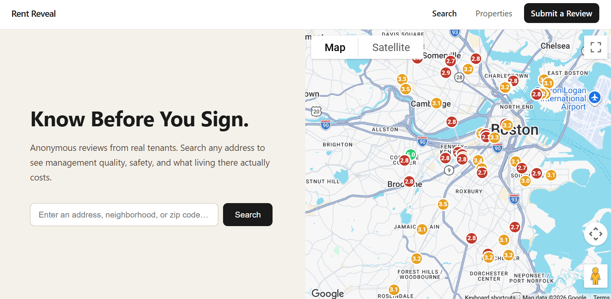
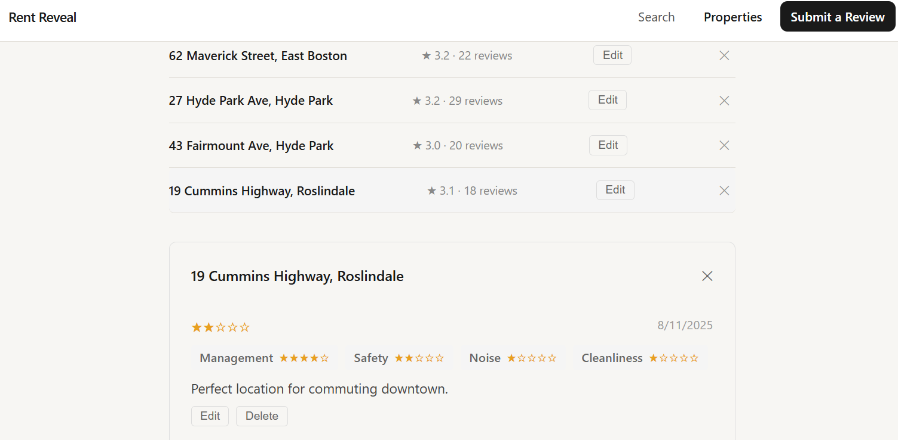

# Rent Reveal

A web app where renters can anonymously submit and browse reviews about properties they have lived in.

Built for CS4550 Web Development – Northeastern University  
[Class Link](https://johnguerra.co/classes/webDevelopment_fall_2024/)

## Authors

- Alex Perkins
- Tom Howes

## What it does

Rent Reveal lets you look up any rental address and see what past tenants actually thought of it — management responsiveness, safety, noise levels, cleanliness, and overall experience. No landlord-curated photos, no incentivized reviews. Just honest feedback from people who lived there.

If a property isn't listed yet, you can add it and leave the first review.

## Screenshots




## Tech Stack

- Frontend: Vanilla JavaScript, HTML5, CSS3
- Backend: Node.js + Express
- Database: MongoDB Atlas (Native Node.js Driver)
- Maps: Google Maps JavaScript API
- Hosting: Render (backend), Netlify (frontend) (Note: backend is hosted on Render free tier and may take up to 60 seconds to wake up on first load.)

## How to run locally

1. Clone the repo

```bash
git clone https://github.com/alexanderperkins/rent_reveal.git
cd rent_reveal
```

2. Install dependencies

```bash
npm install
```

3. Create a `.env` file in the root with the following:

```
MONGODB_URI=your_mongodb_connection_string
PORT=3000
MAPS_API_KEY=your_google_maps_api_key
```

4. Start the dev server

```bash
npm run dev
```

5. Open `http://localhost:3000` in your browser

## Seeding the database

To populate the database with sample properties and reviews:

```bash
npm run seed
```

This will insert 50 Boston-area properties with 1,000+ reviews.

## Project structure

```
rent_reveal/
├── css/              # Styles per page
├── js/               # Frontend JS per page
├── pages/            # HTML pages
├── src/
│   ├── db.js         # MongoDB connection module
│   ├── server.js     # Express server
│   ├── seed.js       # Database seeder
│   └── routes/
│       ├── properties.js
│       └── reviews.js
├── index.html        # Home page with map
└── .env.example      # Environment variable template
```

## License

MIT
